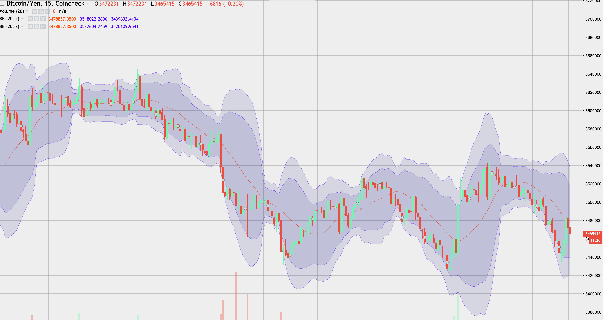

## Automated Bitcoin Trading Bot
Python を使ったビットコインを自動売買してくれるボット

Coincheck の API を使用して価格を取得し、ボリンジャーバンドを計算し、それをもとにビットコインを売り買いします。また、下がり過ぎているときには、損切りもしてくれます。
売買の結果を LINE に通知してくれる機能もあります。

自分の作ったプログラムでお金が増やせたらいいなと思って作りました。（そんなにうまくはいかない）
